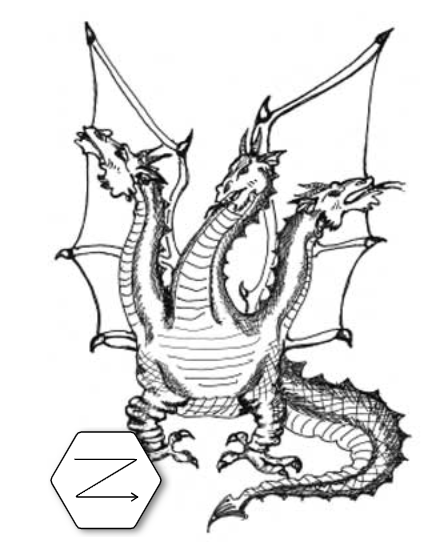

# Zmei code generator

Zmei generator is started as simple scaffolding tool for Django. Now it is powerfull
code generator that automate routine work and gently integrates generated sources into your custom code.

## Features

- Quick create configured Django project
- Compact dsl for generating Django-views and models
- Pycharm plugin for syntax highlighting
- Automatic django-admin generation including complex ones: polymorphic, inlines, translatable
- Powerful CRUD generator
- React application generator (TODO: not documented) + channels websocket integration
- Flutter application generator (TODO: not documented)
- Automatic generation of REST endpoints
- Flexible plugin system

## Installation 

Generator is written in python. Install with pip python packaging tool (preferably in virtual environment):

`pip install zmei-cli`
 
## Quick start

Create file "main.col" with page declaration:

    [index: /]
    @markdown {
        # Hello, world!
    }
 
And run zmei command:
 
    zmei gen up
    
In less than a minute you will get all dependency installed and django application
with hello world page on http://127.0.0.1:8000/

## Next steps

See [documentation](https://zmei-framework.com/generator/).

Read tests [unit](https://github.com/zmei-framework/generator/tree/master/tests/unit),
[en2end](https://github.com/zmei-framework/generator/tree/master/tests/end2end).

## Help

Ask on [https://www.reddit.com/r/zmei/](https://www.reddit.com/r/zmei/) if you need
any help, or fill an issue.

### Articles

- [Django application in 60 seconds](https://zmei-framework.com/generator/blog/0_Zmei_quick_start.html) 
- [Django REST & Admin with a nice theme in 60 seconds](https://zmei-framework.com/generator/blog/1_Zmei_quick_start_2.html#sec-2)

## Plugins

- [Flutter plugin](https://github.com/zmei-framework/zmei-gen-flutter)

## Contribution

Contributions are highly appreciated. Project is huge and it is hard to develop it alone.

You can contribute by:
- Improve [documentation](https://github.com/zmei-framework/generator/tree/master/docs)
- Test, write bug reports, propose features
- Add new features
- Fix bugs, improve code base, add your features
- Write articles, blog-posts with your experience using the generator
- Write plugins, improve existing ones

## Authors

- Alex Rudakov @ribozz

## Contributors

Thanks goes to these wonderful people ([emoji key](https://github.com/all-contributors/all-contributors#emoji-key)):

<!-- ALL-CONTRIBUTORS-LIST:START - Do not remove or modify this section -->
<!-- prettier-ignore -->
<table><tr><td align="center"><a href="https://github.com/rumjantsevv"> <b>rumjantsevv</b></a> <a href="https://github.com/zmei-framework/generator/issues?q=author%3Arumjantsevv" title="Bug reports">🐛</a> <a href="#userTesting-rumjantsevv" title="User Testing">📓</a></td><td align="center"><a href="https://github.com/EternalSoul"> <b>Vladimir Bezuglõi</b></a> <a href="https://github.com/zmei-framework/generator/issues?q=author%3AEternalSoul" title="Bug reports">🐛</a> <a href="https://github.com/zmei-framework/generator/commits?author=EternalSoul" title="Code">💻</a></td></tr></table>

<!-- ALL-CONTRIBUTORS-LIST:END -->

This project follows the [all-contributors](https://github.com/all-contributors/all-contributors) specification. Contributions of any kind welcome!

### Thanks to

- github, travis-ci.com and codecov.io for free great services for Open Source projects!

## LEGAL NOTICE

Source code is distributed under GNU General Public License v3.0 licence. Full licence text is available in LICENSE file.

In-short about GPLv3:
- All software that use Zmei-generator as it's part **MUST** be open-sourced as well: plugins, other generators
 based on it, etc.
- You **CAN NOT** take Zmei-generator and sell it as a paid service without open-sourcing it
- But, you **CAN** use Zmei generator as a tool to write any software including private closed source software
 

Software is free for non-commercial use. For commercial use ask for dual-licensing options. 

