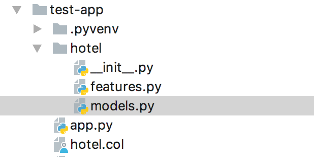
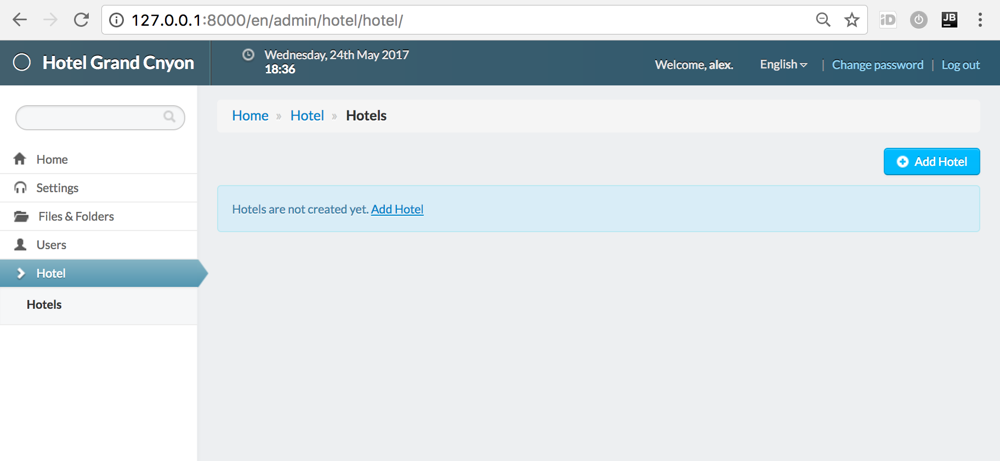
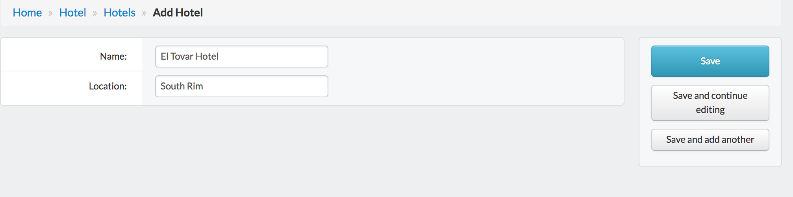
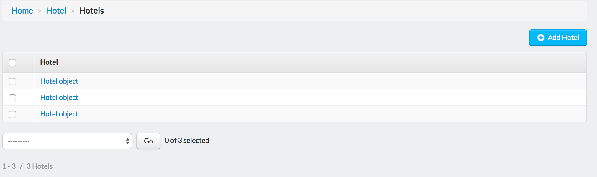
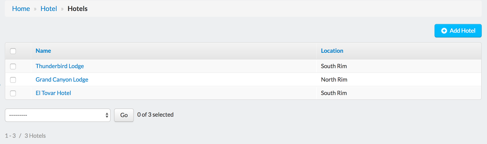
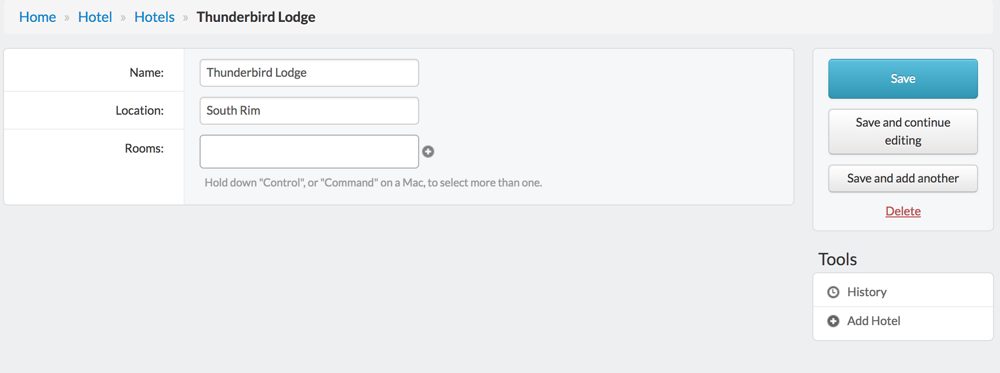
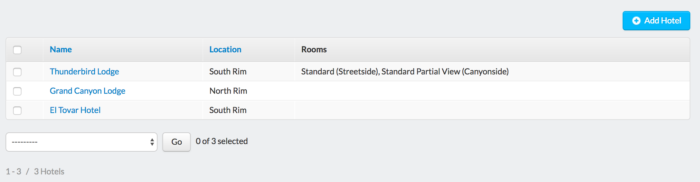
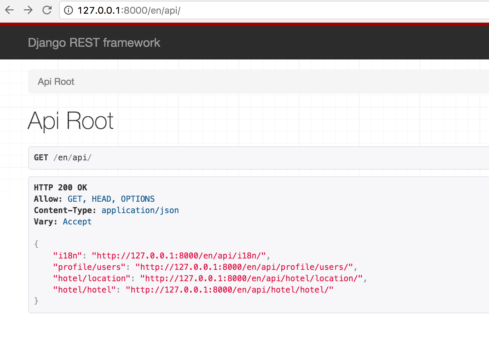
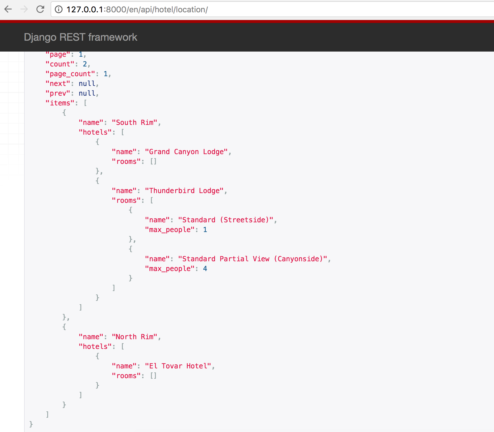
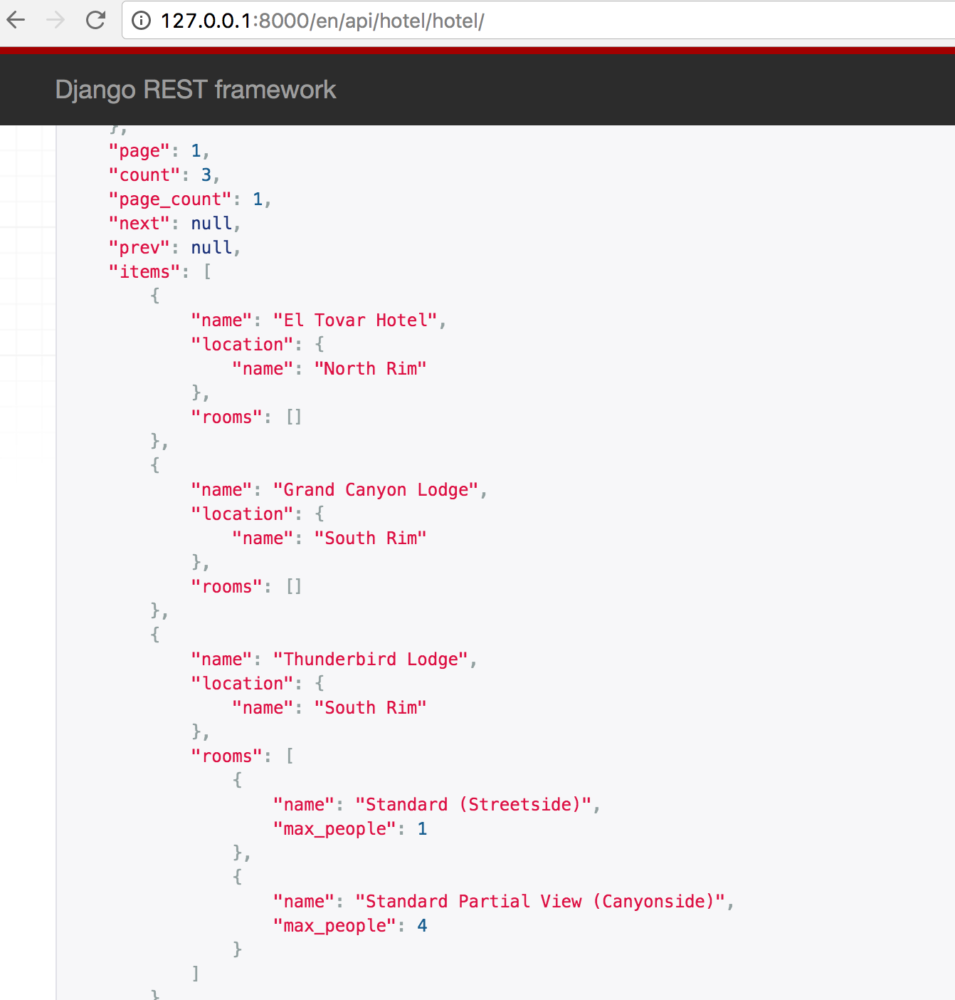

Collections generator
========================

Cratis Lib has powerful module for Django code-generation. It allows to generate
models, admin and rest API from easy to write configuration file.

In this tutorial we will create small Hotel booking application.

Preparation
----------------

Add :class:`Generator <cratis_generator.features.Generator>` to app.py::

    from cratis import App
    from cratis.features import Common

    from cratis_common.db import Mysql
    from bundles import CratisCms
    from cratis_generator.features import Generator

    app = App(locals())

    app.load(
        Common(),

        Mysql('mydb', user='root', password='123123'),

        CratisCms(title='Hotel Grand Cnyon'),

        Generator()
    )

    app.run()

Install deps::

    $ django install

Make sure generator is working::

    $ django gen

Nothing should be displayed.

First experiment
---------------------

Let's create simple collection definition in *hotel.col* file::

    #hotel
    -----------
    name
    location

and run generator again::

    $ django gen

This time generator picked up our collection file, and created new feature and models file:

Now we need migrations to create database structure. We can generate migrations now::

    $ django makemigrations hotel

    Migrations for 'hotel':
      0001_initial.py:
        - Create model Hotel

    $ django migrate hotel

There is another way to generate migrations quicker, but first lets unapply & remove all the migrations::

    $ django gen --remove hotel

    Unapplying migrations
    Operations to perform:
      Unapply all migrations: hotel
    Running migrations:
      Rendering model states... DONE
      Unapplying hotel.0001_initial... OK
    Removing migrations

Better to generate migrations with *gen* command. It will generate code, create migrations and apply migrations. All in one command::

    $ django gen --auto

    Application hotel
    hotel
    Migrations for 'hotel':
      0001_initial.py:
        - Create model Hotel
    Operations to perform:
      Apply all migrations: hotel
    Running migrations:
      Rendering model states... DONE
      Applying hotel.0001_initial... OK

.. note::
    Starting from this moment, every time we change something in *hotel.col* we will execute *gen --auto* command.

Admin panel
--------------

Now let's add admin to our collection::

    #hotel
    -----------
    name
    location

    @admin

Now we can run app and check our admin panel:

Yeah, that easy. @admin tag will register default admin that we will tweak in a moment.

Let's add couple hotels:

After adding hotels, you will see that, our hotel list looks not too friendly:

Let's fix it::

    #hotel
    -----------
    =name
    location

    @admin

"=" modifier says, that this field will be used as *name* of object. Now it's already better:

.. image:: img/gen_5.png
    :width: 80%

Another thing we can do, is to specify what fields to show in admin list::

    #hotel
    -----------
    =name
    location

    @admin {
        list: *
    }

.. note::
    Parser is very tolerant, so we can format declaration as needed, ex. inline::

        @admin {list: *}

    Also we can add excluded fields::

        @admin {list: *, ^name}

    Or just enumerate field names::

        @admin {list: name, location}

Now it looks a way better:

Relations
---------------

Now let's add rooms to our hotel::

    #room
    -----------
    =name
    max_people: int

    @admin {list: *}

    #hotel
    -----------
    =name
    location
    rooms: many(#room)

    @admin {list: *}

As usually, generator will do all the dirty work for us::

    $ django gen --auto

    Application hotel
    Migrations for 'hotel':
      0002_auto_20170524_1856.py:
        - Create model Room
        - Add field rooms to hotel
    Operations to perform:
      Apply all migrations: hotel
    Running migrations:
      Rendering model states... DONE
      Applying hotel.0002_auto_20170524_1856... OK

Now our hotel editing form has field for rooms:

If you click on this small "+" sign next to rooms field, popup for adding new room will be shown.

Now our list shows rooms as well, but doesn't look nice:

Let's remove it from list::

    ...

    #hotel
    -----------
    =name
    location
    rooms: many(#room)

    @admin {list: *, ^rooms}

Another thing we can do, is to move location into separate model. First let's remove location field::

    #room
    -----------
    =name
    max_people: int

    @admin {list: *}

    #hotel
    -----------
    =name
    rooms: many(#room)

    @admin {list: *, ^rooms}

And then execute *gen --auto* as usually::

    $ django gen --auto

Now let's add new model and field::

    #room
    -----------
    =name
    max_people: int

    @admin {list: *}

    #hotel
    -----------
    =name
    rooms: many(#room)

    @admin {list: *, ^rooms}

.. note::
    Always remove and then add back fields if field change data type.

After that two-step manipulation we have separate table for locations.

Rest API
----------------

Next step is to create Rest API.

Let's say we need to have api for looking hotels by location::

    #location
    -----------
    =name

    @admin {list: name}
    @rest {
        fields: *
        inline: hotels(
            fields: *, ^location
            inline: rooms(
                fields: *
            )
        )
    }

And just list of hotels with rooms and location inline::

    #hotel
    -----------
    =name
    location: one(#location -> hotels)
    rooms: many(#room)

    @admin {list: *, ^rooms}
    @rest {
        fields: *
        inline: rooms(fields: *), location(fields: *, ^hotels)
    }

Then if we open `http://127.0.0.1:8000/en/api/` we will see two new apis added:

