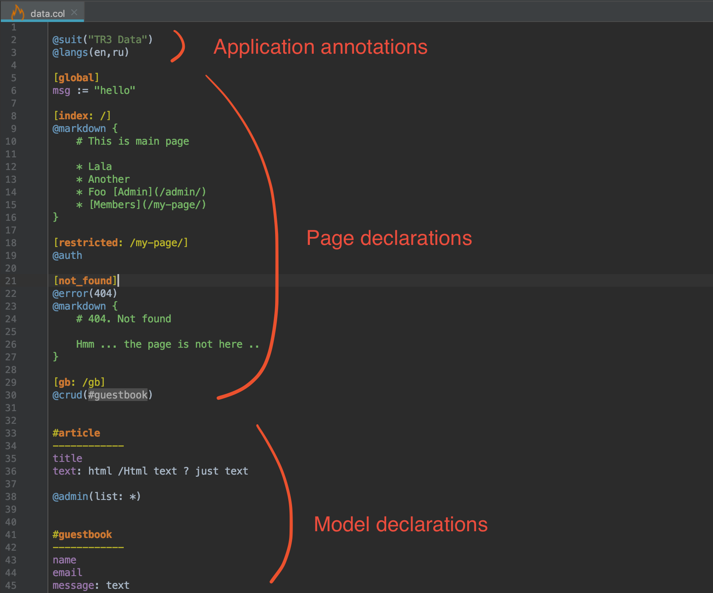

Col file structure
#####################

.. note::

    It is highly recommended to install Zmei PyCharm plugin, if you are using PyCharm. It adds
    handy syntax highlighting as on screenshot bellow.

Typical col file have Application annotations, pages, models. Order is important!

Also in .col file you can use python :ref:`Imports`. It's separate topic, but it worth to mention
that there is such feature in .col files.

Parts overview
================

Application annotations
-------------------------

Application annotations are something that is not relevant to pages or models, but provides
useful functionality to the application.

Pages
-------

Pages are namely website pages.

More about :ref:`Pages`

Models
--------

Models are application data that is stored in database.

More about :ref:`Models`

