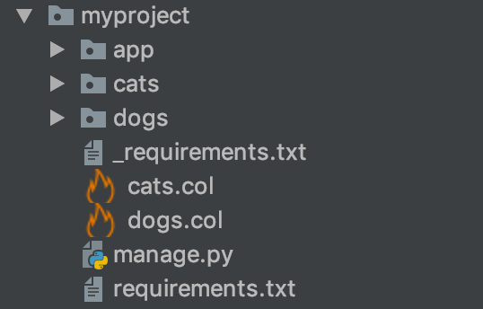
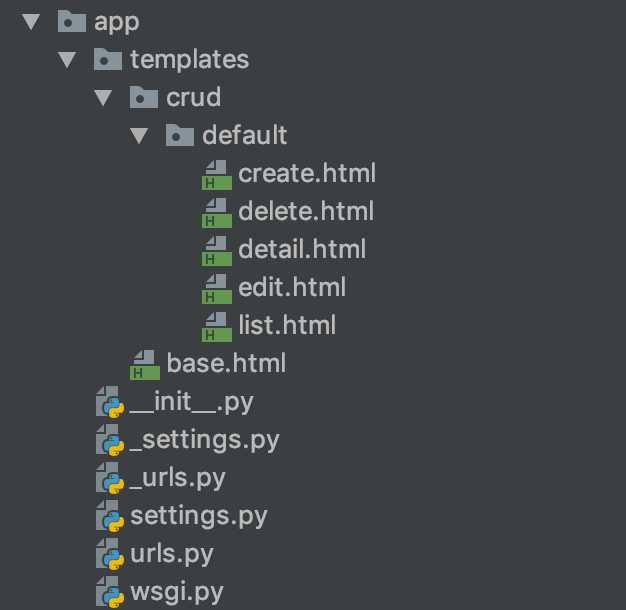

Generated code structure
###########################

When Zmei generator produce code, file structure looks like this:

Let's what is inside.

Requirements file
===================

First thing you may notice, is two requirements.txt files. It is standard file name for
file `containing all the project dependencies <https://pip.pypa.io/en/stable/user_guide/#requirements-files>`_.

Why two? Let's see ..

_requirements.txt::

    # generated: e24bdd8e0f9dc6fb35eb93e1444c035c

    django-suit
    django>2
    zmei-utils==0.1.12
    django-modeltranslation==0.13-beta1
    wheel
    django-ckeditor

requirements.txt::

    -r _requirements.txt

First one is generated by Zmei, it place all requirements it needs there.

The second one is for you.
In second file you will see only one line that includes first one. Feel free to add your own dependencies on a new line.

manage.py
===========

manage.py is standard Django file for running Django.

You can see list of available commands by runing it without argunments::

    python manage.py

"app" folder
===============

Now closer look at app folder.

Settings file
-----------------

There are two settings file. Same story as with requirements.txt files. One with "_" is for Zmei,
and without it for you.

Your one extends Zmei's one.

Here is an example how you can override properties from _settings::

    from ._settings import *

    # Add your custom settings here

    if not DEBUG:
        ALLOWED_HOSTS += ['cat.genius-apps.com']

.. note::
    Generator automatically register all your application in _settings.py file

Urls file
-------------

Absolutely same thing as with settings and requirements.

.. note::
    Generator automatically register all your application in _urls.py file

Templates
-----------

In templates you may find base.html - base layout template, and standard crud theme.

"cats" and "dogs" -- application folders
------------------------------------------

Those folder get it names after name of the col files you create.

Structure of folders is standard django application layout:

.. image:: img/str3.png
    :width: 300px
