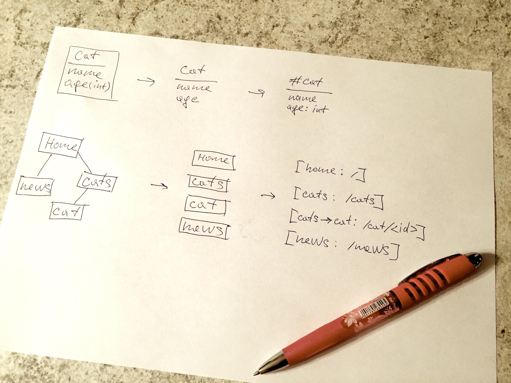

============
Philosophy
============

Zmei generator basic idea is to create a very simple markup language that
would be very natural, easy to write and very similar to what we draw on a paper
when we plan a web application.

The generator design principles:

**Clean code**
    Generate code that is clean, readable and easy to support by hands.

**Plain Python**
    No tools required, except python.

**Plain Django**
    Generated code should be plain Django application, no magic involved.

**No configs**
    Maximum simplicity. No configuration required to create a new application.