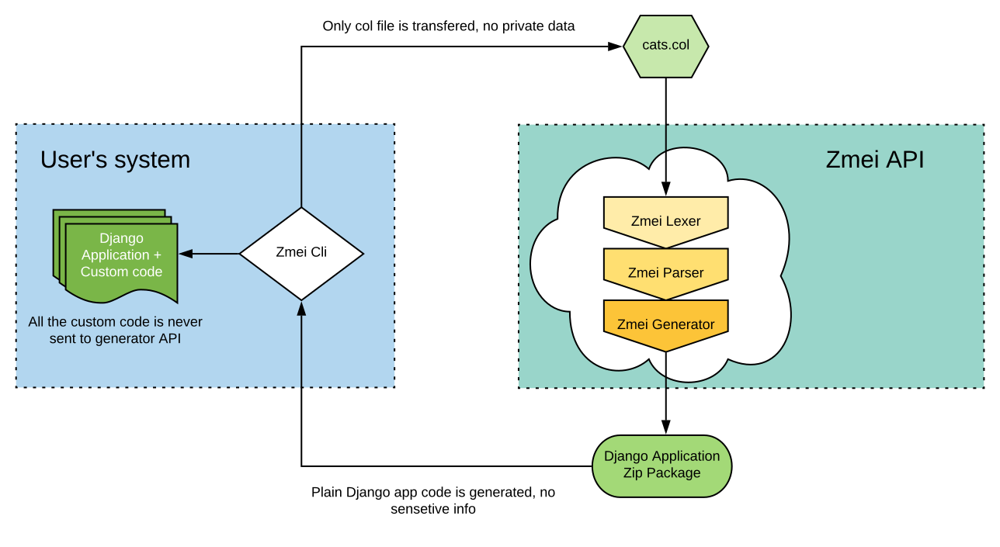

===============
How it works?
===============

Zmei generator is API that sits on zmei-framework.com, accepts *.col files as an input and produce Django application code.
Special utility called zmei-cli is a client for generator API.

Generator itself software, through all other parts of Zmei is open. You can see them on Zmei's github: https://github.com/zmei-framework

Parts of Zmei framework
==========================

Zmei Generator
-------------

http://zmei-framework.com:9000/

This is api of the generator. See zmei-cli sources to understand how to work with it.

LICENCE: closed source, proprietary.

Grammar
-------------

https://github.com/zmei-framework/grammar

This is full ANTLR4 Zmei-language specification. It is used by generator directly and always up to date.
You can use it as reference to implement own tooling (ex plugin for IDE).

LICENCE: MIT

Zmei-cli
-----------

https://github.com/zmei-framework/zmei-cli

Tool that pack col file send them to generator, unpack code and run Django commands in right sequence to put
application wokring.

LICENCE: MIT

Zmei-utils
-------------

https://github.com/zmei-framework/zmei-utils

Set of useful Django helpers to provide missing functionality to zmei-generated apps.
Zmei-utils are also usable even without generator.

LICENCE: MIT

Intellij plugin
------------------

https://github.com/zmei-framework/zmei-intellij-plugin

Language support plugin for pycharm.

LICENCE: MIT

Genius documentation
----------------------

https://github.com/zmei-framework/generator-docs

This documentation sources.

LICENCE: MIT

