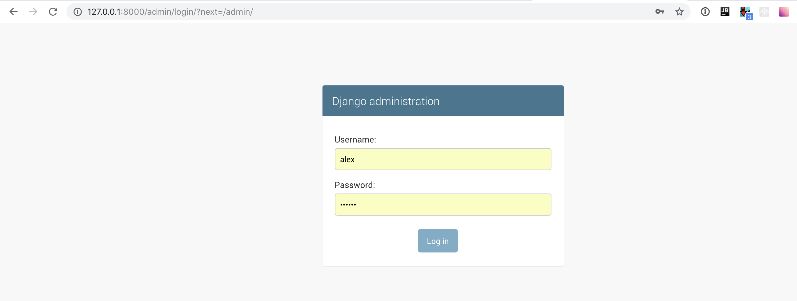

.. _60sec_2:

Django REST & Admin with a nice theme in 60 seconds
====================================================

.. post:: Nov 27, 2018
   :category: Tutorial
   :tags: intro, rest, admin, 60sec
   :author: Alex Rudakov

This is a next article from "Django in 60 seconds" series.

* :ref:`60sec_1`
* :ref:`60sec_2`
* :ref:`60sec_3`

In the previous article we created a simple Django application. That is able to do some simple things.
This time we will add REST API and administration panel.

REST Api
---------------

Last time we left on this col file::

    [index: /]
    @crud(#cat)

    #cat
    -----------
    =name
    age: int

Let's add some api here::

    [index: /]
    @crud(#cat)

    #cat
    -----------
    =name
    age: int

    @rest
    @api

After that change, Zmei generator will detect the change happened and restart/regenerate Django code.
Or if you stopped the app, then just go to the project folder, reactivate virtualenvironment and start again::

    $ workon cats  # this line assumes you are using virtualenvwrapper

    $ zmei gen up

And if you go to the http://127.0.0.1:8000/api/ url, you will see our API:

.. image:: img/api.png

Admin
-----------

Now it's time to add admin part to our application::

    [index: /]
    @crud(#cat)

    #cat
    -----------
    =name
    age: int

    @rest
    @api

    @admin(list: *)

Zmei will pick up our changes and generate admin part http://127.0.0.1:8000/admin/:

But in order to log in there, you need to create a superuser. Hit Ctrl (or Cmd) + C to stop Zmei and run::

    $ python manage.py createsuperuser

After that you can log in to the admin panel:

.. image:: img/admin2.png

Let's make it a bit nicer::

    @suit("My cats admin")

    [index: /]
    @crud(#cat)

    #cat
    -----------
    =name
    age: int

    @rest
    @api

    @admin(list: *)

Just wait until Zmei will install dependency and restart the app:

.. image:: img/admin3.png

Nice! Now we have much nicer admin-side.

.. note::
    Django-suit is paid for commercial use. See http://djangosuit.com/pricing/

Polishing
-----------

And final steps. Our frontend crud allows to add cats and even delete.
Let's leave the ability to add cats by anyone, and remove edit/delete view, so nobody
can delete or edit other's cats::

    @suit("My cats admin")

    [index: /]
    @crud(
        #cat,
        skip: edit, delete
    )

    #cat
    -----------
    =name
    age: int

    @rest
    @api

    @admin(list: *)

Here it is:

.. image:: img/crud.png

.. raw:: html

    <iframe width="660" height="415" src="https://www.youtube.com/embed/mdMZVPjU_9Y" frameborder="0" allow="accelerometer; autoplay; encrypted-media; gyroscope; picture-in-picture" allowfullscreen></iframe>

... to be continued
-----------------------

Next time we will learn how to deploy the application to Zmei Apps so our cat-manager can see the entire world... Stay tuned ;)
